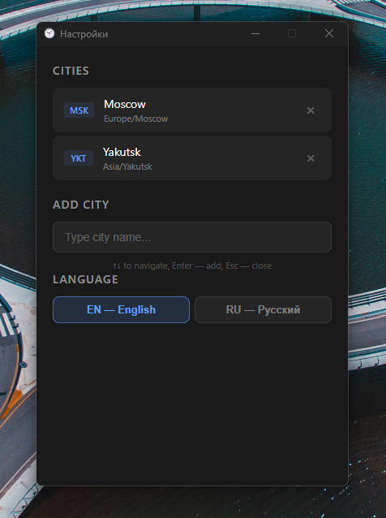

# World Clock

🇷🇺 [Русский](README.ru.md)

A desktop widget for Windows that displays the current time for multiple cities across different timezones simultaneously, right above the taskbar.

## Screenshots

&nbsp;&nbsp;

## Features

- Multiple time zones displayed simultaneously
- Search and add any city in the world
- City labels switch between Cyrillic and Latin codes when changing language
- Always on top, stays out of your way
- System tray icon for quick access
- English and Russian interface

## Installation

1. Download `World Clock Setup 1.0.0.exe` from the [Releases](../../releases) page
2. Double-click the installer
3. Click **Yes** in the UAC prompt — the app requires administrator rights to display above the taskbar
4. Installation completes automatically and a shortcut appears on your desktop

## Usage

After launch, the clock appears in the bottom-left corner of the screen above the taskbar.

**Tray icon** (bottom-right corner):
- **Right-click** — menu: show/hide, settings, exit
- **Double-click** — open settings

**Settings:**
- Search for a city by name (in English or Russian)
- Click a city in the list to add it
- Click `×` next to a city to remove it
- Switch interface language at the bottom of the settings window

## Language

The app defaults to **English**. To switch to Russian, open Settings and click **RU — Русский** at the bottom. All labels — including city codes in the widget — update instantly.

## Run on Windows Startup

To launch the clock automatically when Windows starts:

1. Press `Win + R`, type `shell:startup`, press **Enter**
2. Copy the **World Clock** shortcut from your desktop into the folder that opens

The clock will now start with Windows.

## Pin Tray Icon

The app runs as a widget — the clock window is always visible above other programs. It is controlled through the **system tray** icon (notification area near the Windows clock).

To keep the tray icon always visible:

1. Right-click the taskbar → **Taskbar settings**
2. **Notification area** → **Select which icons appear on the taskbar**
3. Find **World Clock** and turn it on
